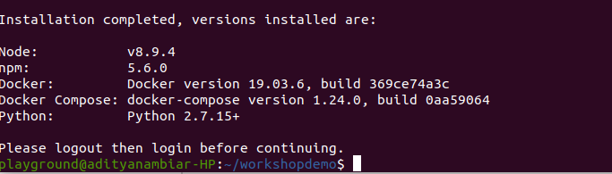

# TCET Workshop Documentation on Hyperledger Fabric 
## Getting Started
- Create a folder to keep all of your fabric components together under one folder. We further refer to this folder as our 'project folder'.
### Installing Hyperledger Composer and its developement tools
- Refer [the official documentation page](https://hyperledger.github.io/composer/latest/installing/installing-prereqs.html) to know which prerequisites are being installed in the script below. The only issue with the script they provide is that its outdated and therefore we updated the script to make sure it does it correctly.
1. Prerequisites
- Download the prerequisites script added in this repository. [Click here](https://raw.githubusercontent.com/AdityaNambiar/tcethlfworkshop/master/prereqs-ubuntu-updated.sh) and press CTRL+S to save the bash script (as .sh file) in your project folder. 
- Give the execute permission if needed and execute the script:
```
$ chmod +x prereqs-ubuntu-updated.sh
$ ./prereqs-ubuntu-updated.sh
```
  - The following should be seen on your terminal, marking successful completion of the script. Each tool **must** show its version as intended and nothing that says 'command not found' or similar.
  

2. Developement tools and bash scripts
- Here we will be adding the composer tool and a folder that gives us few automated script to run composer's blockchain network. 
- [Click here](https://hyperledger.github.io/composer/latest/installing/development-tools.html) to open the website which we are going to refer to.
  - Download each one of them as listed under Step 1 till Step 4.
  - Execute ./startFabric.sh file => This will start the hyperledger fabric.
  - Now create the PeerAdmin Card:
    - Execute the createPeerAdminCard.sh file 
		  `./createPeerAdminCard.sh`
      This will create a card name as PeerAdmin@hlfv1

  
    
