# TCET Workshop Documentation on Hyperledger Fabric 
## Website URL: https://adityanambiar.github.io/tcethlfworkshop/ 
## Getting Started
- Create a folder to keep all of your fabric components together under one folder. We further refer to this folder as our 'project folder'.
### Installing Hyperledger Composer and its developement tools
- Refer [the official documentation page](https://hyperledger.github.io/composer/latest/installing/installing-prereqs.html) to know which prerequisites are being installed in the script below. The only issue with the script they provide is that its outdated and therefore we updated the script to make sure it does it correctly.  
1. Prerequisites  
- Download the prerequisites script added in this repository. [Click here](https://raw.githubusercontent.com/AdityaNambiar/tcethlfworkshop/master/prereqs-ubuntu-updated.sh) and press CTRL+S to save the bash script (as .sh file) in your project folder.  
- Give the execute permission if needed and execute the script:
```
$ chmod +x prereqs-ubuntu-updated.sh
$ ./prereqs-ubuntu-updated.sh
```  
  - The following should be seen on your terminal, marking successful completion of the script. Each tool **must** show its version as intended and nothing that says 'command not found' or similar.
    

2. Developement tools and bash scripts  
- Here we will be adding the composer tool and a folder that gives us few automated script to run composer's blockchain network.  
- [Click here](https://hyperledger.github.io/composer/latest/installing/development-tools.html) to open the website which we are going to refer to.  
  - Download each one of them as listed under Step 1 till Step 4.  
  - Execute startFabric.sh file by doing:  
  	`./startFabric.sh`	=> This will start the hyperledger fabric.
  - Now create the PeerAdmin Card:
    - Execute the createPeerAdminCard.sh file  by doing:  
      `createPeerAdminCard.sh`
      => This will create a card name as PeerAdmin@hlfv1
  - Deploying Business-Network-file (BNA or .bna) to the fabric:
    - Create the archive of your project:
      Go to the project folder directory where package.json file resides.
      Execute the following command:  
      `composer archive create -t dir -n ./`
      => The .bna file will be created. For example, BNA file name is projectname@0.0.1.bna
    - Install that bna(business-network-application) to the fabric:  
      `composer network install -a project@0.0.1.bna -c PeerAdmin@hlfv1`
    - Start the network:  
      `composer network start -c PeerAdmin@hlfv1 -n projectname -V 0.0.1 -A admin -S adminpassword`
      **Note**: Make sure your internet connection is on.
    - Importing the Admin Card to the fabric:  
      `composer card import -f admin@projectname.card -c admin@projectname.`
    - Ping the network to check everything is correct:
      `composer network ping -c admin@projectname`
  - Stopping the network:
    - Execute the file stopFabric.sh
      Command: `./stopFabric.sh`
    - Remove all the cards generated:   
      	a. Go to the /home/<your_username>/.composer/cards directory and delete all cards.
        b. Delete all __.card__ files (exported / downloaded files).
      **NOTE**: Incase you cant find .composer folder in your home directory , enable show hidden files option in ubuntu system.
  - Incase you are facing errors and want to flush the network:  
    - Find the `teardownFabric.sh` script in fabric-dev-servers folder (or any renamed folder where you downloaded your 	developement tools) and execute it.
    - If you don’t find the script perform the below operations: 
      Command: `docker rm $(docker ps -aq)`
 
**Congratulations, you successfully installed Hyperledger Fabric and Hyperledger Composer on your system. This is a single peer setup and everything happens on the localhost**

### Setting up Hyperledger Fabric for handling multiple peers:
1. Prerequisites:  
  - This setup assumes you already have the single peer setup ready for your HLF project.  
2. Stages:  
**MAIN PEER SETUP**:  
  a. We need to download and install the binaries required from this website: [Install Samples, Binaries and Docker Images
](https://hyperledger-fabric.readthedocs.io/en/release-1.4/install.html).  
  b. Update the crypto-config.yaml to desired number of peers and generate that many certificates for them.
  c. Generate new crypto material and create the genesis block.   
  d. Add the orderer and peer TLS CA Certificates to PeerAdmin connection profile.  
  e. Update the `docker-compose.yaml` and `docker-compose-dev.yaml` file to add other peers machine IPs under _extra_hosts_.  
  f. Pass the entire 'fabric-script/' folder to the additional peers.  
**OTHER PEER SETUP**:  
  a. After obtaining the updated _fabric-scripts/_ folder from the Main Peer.  
  b. Create and update the docker-compose-peerN.yaml as weel start-peerN.sh (where N = number of your peer) to add the IP of the main peer machine.

3. Process:  
- (Point 2.a - main peer setup)  
i. Execute the following command for the fabric-samples folder to obtain the binaries ('bin/' folder) along with them:
`curl -sSL http://bit.ly/2ysbOFE | bash -s -- 1.4.5 1.4.5 0.4.18`  
ii. Except the 'bin/' folder, delete every other file and folder.  
iii. Add the path environment variable:
This path determines where the crypto materials/fabric-tools and other dependencies of multipeer network are stored.
Command: `export PATH=<path to fabric-samples folder>/bin:$PATH`
Example: export PATH=/home/<your_username>/fabric-samples/bin:$PATH  
- (Point 2.b - main peer setup)  
i. Put the number of peers (inclusive of all peers on the network) under 'Template -> Count:' in the crypto-config.yaml file as below:
  
ii. Follow steps listed in the **howtobuild.txt** file. You can find this file under (if you did _not_ rename your developement tools folder i.e. fabric-dev-servers):
`fabric-dev-servers/fabric-script/hlfv12/composer`  
  - Set the IPs of main peer and other peers.
  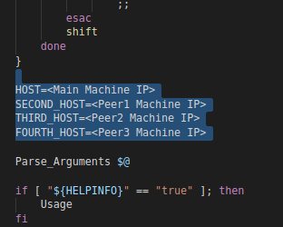  
  - The connection profile in createPeerAdminCard.sh file (mentioned in the howtobuild.txt file) starts from here:
  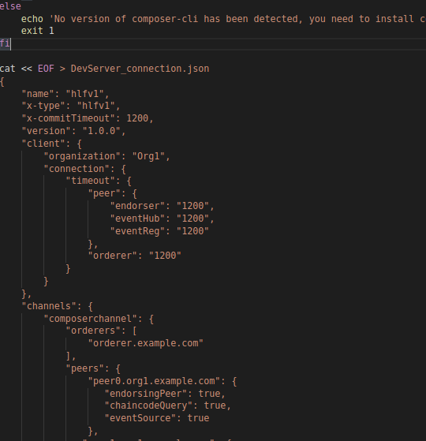  
  - You need to add few things to the _DevServer_connection.json_ file. 
  a. Add additional peers under (channels -> composerchannel -> peers):
  For peer1:
  ```
   "peer1.org1.example.com": {
                   "endorsingPeer": true,
                   "chaincodeQuery": true,
                   "eventSource": true
    },
  ```
  For other peers, just update the suffix of 'peer'. For instance, for peer2:
  ```
   "peer2.org1.example.com": {
                   "endorsingPeer": true,
                   "chaincodeQuery": true,
                   "eventSource": true
    },
  ```
  **NOTE**: Make sure to follow the JSON syntax. Your Peer Admin card won't be able to deploy if you have an error in this connection profile. Use a [JSONlinter](https://jsonlint.com/) tool to rectify your errors by copying and pasting the entire JSON formatted text in the JSONLint. A simple incorrectly placed comma or curly bracket can cause script to halt. 
  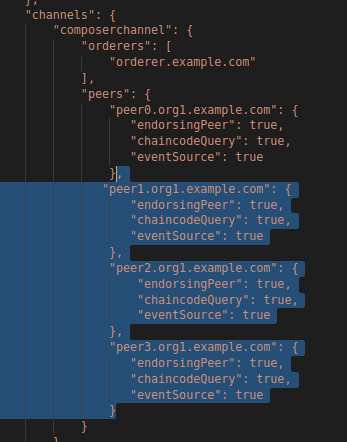  
  b. Add additional peers under (organizations -> Org1 -> peers):
  For peer1:
  `"peer1.org1.example.com"`
  Again, change the suffix of 'peer' to add more peers as we did before.
  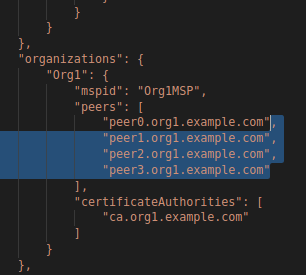  
  c. Add additional peers under (peers):
  For peer1:
  ```
  "peer1.org1.example.com": {
           "url": "grpc://${SECOND_HOST}:8051",
           "eventUrl": "grpc://${SECOND_HOST}:8053",
           "grpcOptions": {
               "ssl-target-name-override": "peer1.org1.example.com"
           },
           "tlsCACerts": {
               "pem": "< Peer1 TLS CA Certificate >"
           }
        },
  ```
  Again, change the suffix of 'peer' to add more peers as we did before (all occurences)
  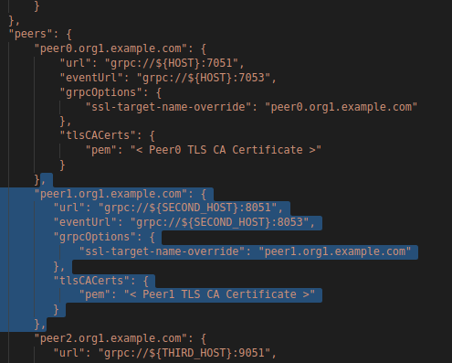
  d. Put the TLS CA Certificates for Orderer and Peers:
  After obtaining the certificates from the command provided in the _howtobuild.txt_ file, add respective certificates to appropriate locations as follows:  
  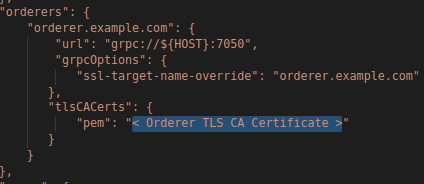
  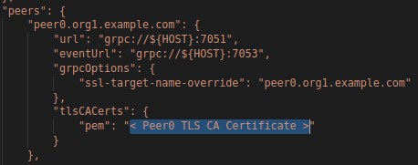  
  Similarly, for more peers:
  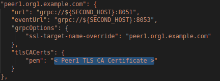
  
  This is how it should look like after adding the peers:
  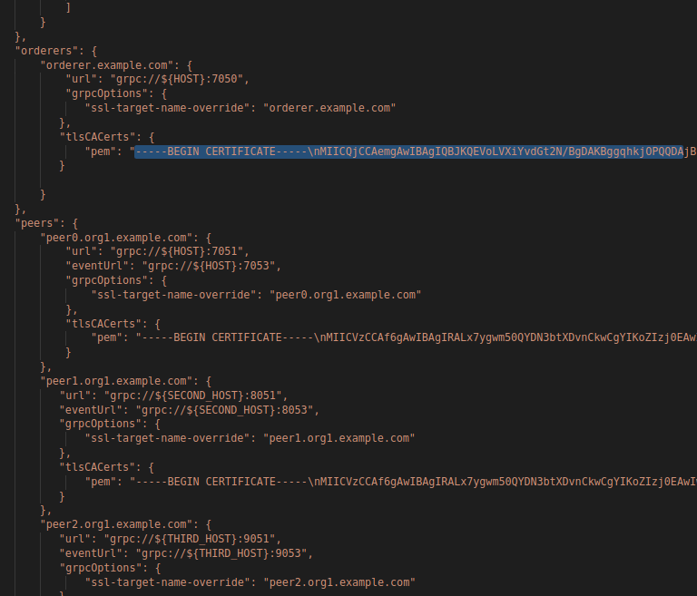  
  e. Update the _docker-compose and docker-compose-dev YAML files_ under (fabric-scripts/hlfv12/composer/):
  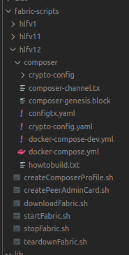  
  Add the other machine IPs (in the format shown below) in **both the files** under (ca.example.com, orderer.example.com, peer0.org1.example.com):  
  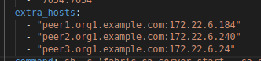   
  For example, adding _extra_hosts_ to CA should look like:  
  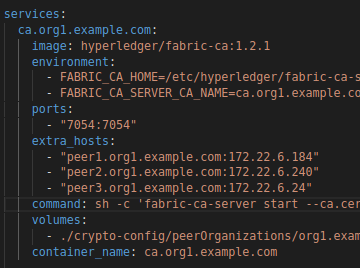  
  f. Send '_fabric-scripts/_' to the other peers in the network.  
  
- (Point 2.a - other peer setup)  
In the other peer, create _docker-compose-peerN.yaml_ and _start-peerN.sh_ under (/fabric-scripts/hlfv12/composer/) as seen below:  
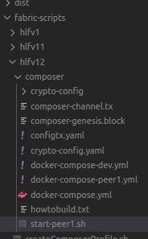  
Add the following to the docker-compose-peerN.yaml:  
For peer1, (change all occurences of peer1 in this code block to respective peer and **make sure to increment the port on the left of colon by thousand** and change all occurences of ports at respective places)  

```
version: '2'

services:
  peer1.org1.example.com:
    container_name: peer1.org1.example.com
    image: hyperledger/fabric-peer:1.2.1
    environment:
      - CORE_LOGGING_LEVEL=debug
      - CORE_CHAINCODE_LOGGING_LEVEL=DEBUG
      - CORE_VM_ENDPOINT=unix:///host/var/run/docker.sock
      - CORE_PEER_ID=peer1.org1.example.com
      - CORE_PEER_ADDRESS=peer1.org1.example.com:7051
      - CORE_VM_DOCKER_HOSTCONFIG_NETWORKMODE=composer_default
      - CORE_PEER_LOCALMSPID=Org1MSP
      - CORE_PEER_MSPCONFIGPATH=/etc/hyperledger/peer/msp
      - CORE_LEDGER_STATE_STATEDATABASE=CouchDB
      - CORE_LEDGER_STATE_COUCHDBCONFIG_COUCHDBADDRESS=couchdb1:5984
    working_dir: /opt/gopath/src/github.com/hyperledger/fabric
    command: peer node start
    ports:
      - 8051:7051
      - 8053:7053
    volumes:
        - /var/run/:/host/var/run/
        - ./:/etc/hyperledger/configtx
        - ./crypto-config/peerOrganizations/org1.example.com/peers/peer1.org1.example.com/msp:/etc/hyperledger/peer/msp
        - ./crypto-config/peerOrganizations/org1.example.com/users:/etc/hyperledger/msp/users
    extra_hosts:
      - "orderer.example.com:<Main peer IP>"
      - "peer0.org1.example.com:<Main peer IP>"
      - "ca.example.com:<Main peer IP>"
    depends_on:
      - couchdb1

  couchdb1:
    container_name: couchdb1
    image: hyperledger/fabric-couchdb:0.4.10
    ports:
      - 6984:5984
    environment:
      DB_URL: http://localhost:6984/member_db
```
  
Update the _docker-compose-peer YAML files_ under (fabric-scripts/hlfv12/composer/):
    
Add the other machine IPs (in the format shown below) in **both the files** under (ca.example.com, orderer.example.com, peer0.org1.example.com) - look at the following for reference:
      
**NOTE**: Update the incremented ports of new peers in the createPeerAdminCard.sh's connection profile. 
  
  


  
    
